# GuGumusic
A miniprogram for music and blog.

### 音乐API来源

[NeteaseCloudMusicApi](https://github.com/Binaryify/NeteaseCloudMusicApi)

### 小程序原型

[wxmusic](https://github.com/zyb718116577/wxmusic)

这是一个音乐小程序，兼具发表博客的功能，音乐来源是Netease，小程序原框架是上面的项目。

一直想做一个属于自己的音乐软件/小程序/网页，但一直苦于没有很好的机会以及模型（~~其实是想到要自己从零搭建就失去幻想~~）万事开头难嘛，正好有课程任务这样的一个要求，推进着我，又找到了这么好的一个现成项目，就~~可以直接抄~~很好地契合了我的想法。

原项目用的是另一家的API，是直接在小程序端发起数据请求的，而在小程序端直接发起请求一方面会占用较多资源，另一方面小程序端发起的请求都是需要认证的（如果想要上线的话，仅仅开发版玩玩就没关系），使用的时候接口也出现了问题，故决定换成现在用的API，然后因为两个API提供的内容具有较大差别，故我对原有的内容展示也进行了大调整，基本上所有的页面都重写了，也增加了不少自己的想法上去，~~其实就是仿大厂UI，毕竟人家的真的好看~~。

另外，由于微信小程序提供的播放监听接口调用出现了问题，估计是因为我要用太多接口了，根源都是基础的接口调用基础接口太过频繁导致出大问题，就自己写了一套函数进行音乐播放状态的监听，实现仅调用一次基础监听接口就可以在音乐停止时自动切歌，外部（指从手机通知栏等处）暂停后调整小程序内相关变量及状态，比较辣鸡但也可以用了。

### 已实现的功能

* 搜索歌曲、专辑、艺人

* 查看热门歌单
* 查看歌手排名
* 创建自己的歌单（目前仅有“我喜欢”歌单）
* 音乐播放控制
* 歌曲优先播放（一般音乐软件歌曲前的“+”）
* 发布博客（支持文本、图片、视频、歌曲分享）
* 博客评论
* 管理自己的博客

### 待实现的功能

* 点赞系统
* 用户粉丝系统
* 博客检索
* 优化播放页面体验
* 更大的曲库/doge
* 待添加。。。（欢迎提出建议，但实现嘛就/doge

### 使用实例

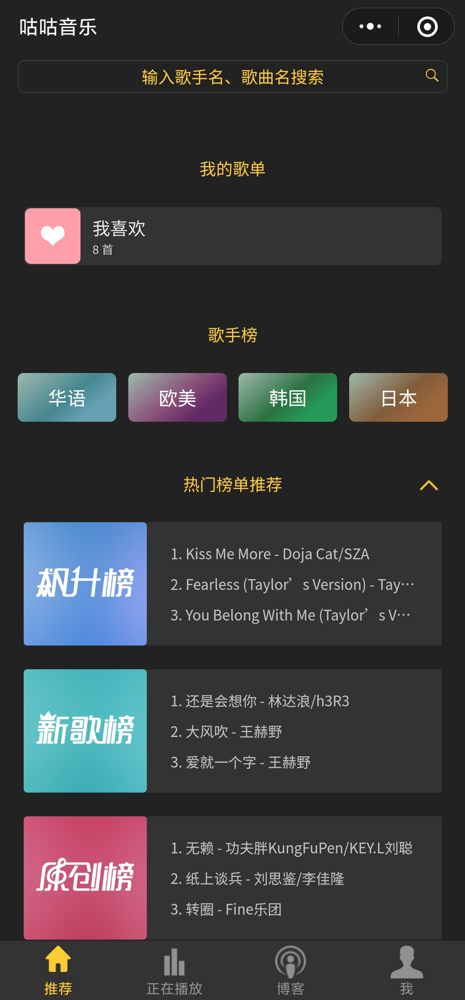 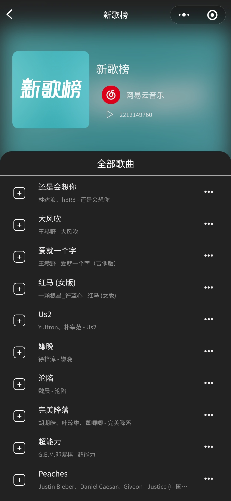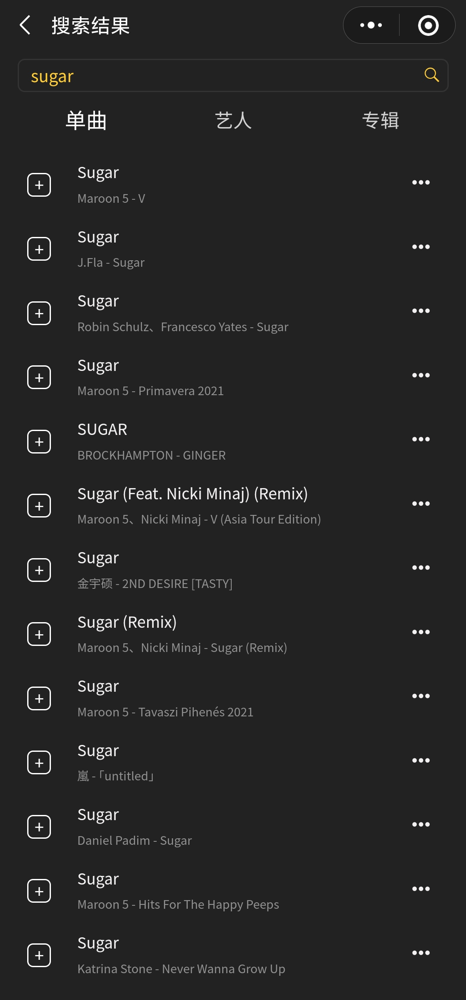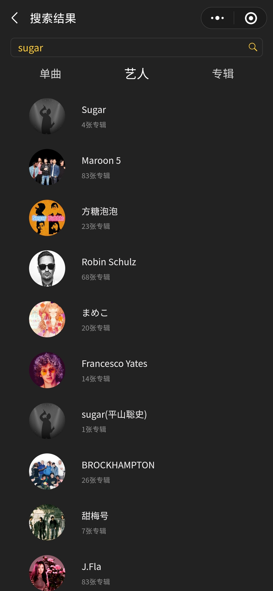
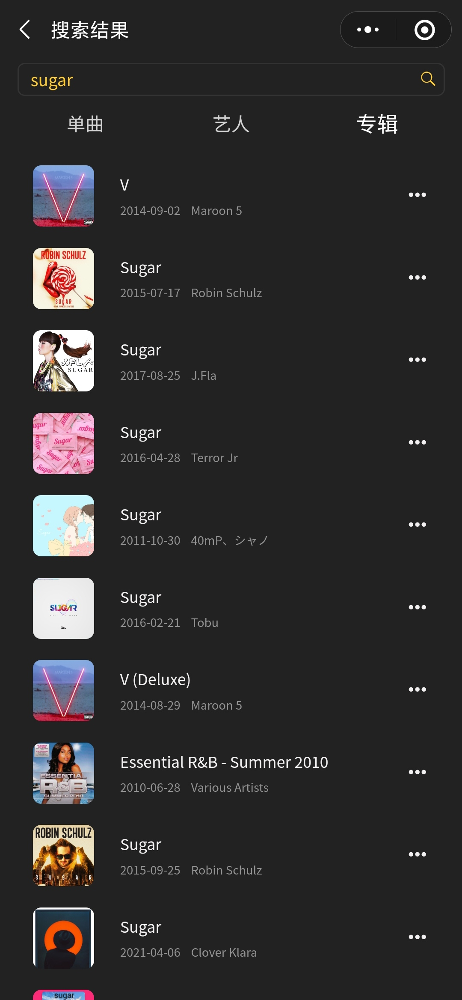 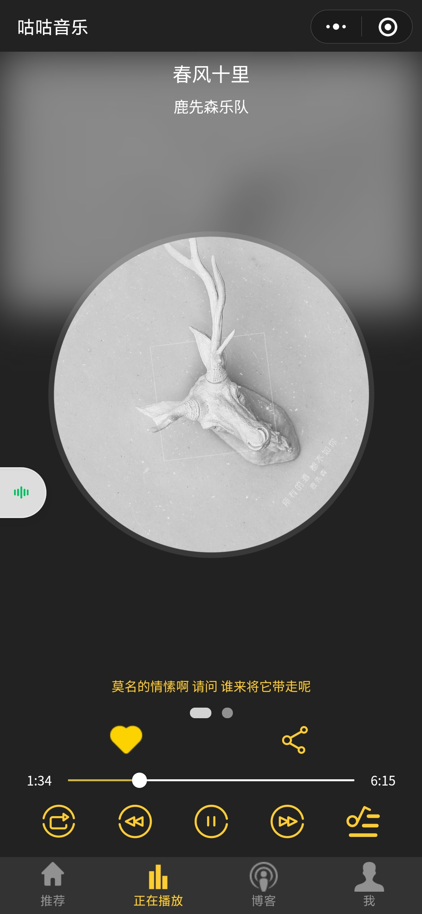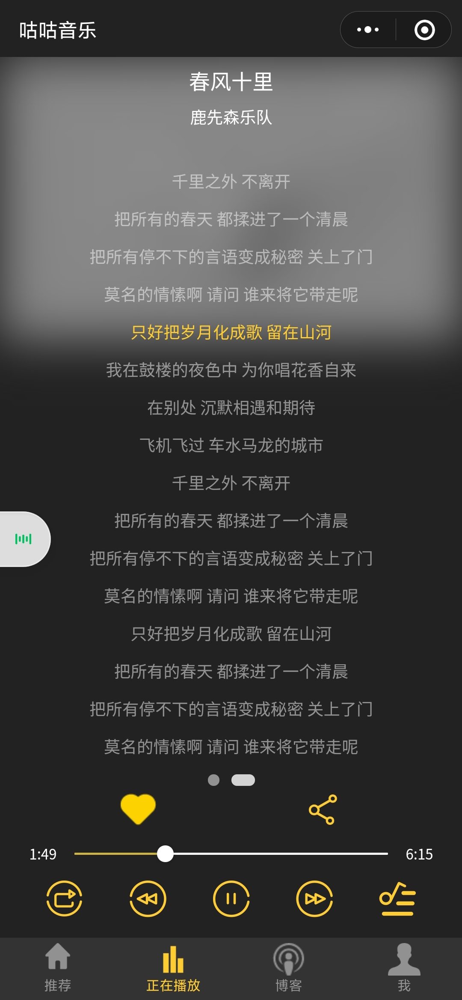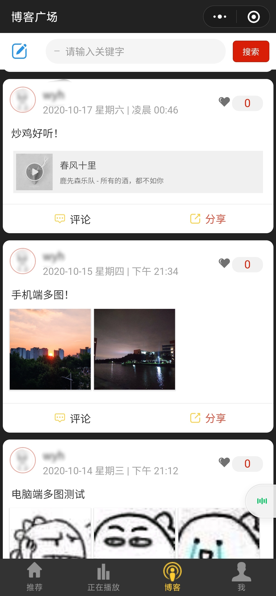

### 使用方法

#### 1.下载本项目 or Fork

#### 2.使用微信开发者工具打开
1. 本小程序用到了微信提供的云开发能力，相当于一个简易的服务器，故需要先注册小程序账号，获得Appid，从而能够使用云开发能力，参照[官方指引](https://developers.weixin.qq.com/miniprogram/dev/framework/quickstart/getstart.html#%E7%94%B3%E8%AF%B7%E5%B8%90%E5%8F%B7)即可

2. 下载[微信开发者工具](https://developers.weixin.qq.com/miniprogram/dev/devtools/download.html)

3. 导入项目，选择该文件夹，填上自己的小程序Appid（第一步的指引中有）,选择小程序·云开发并打开

   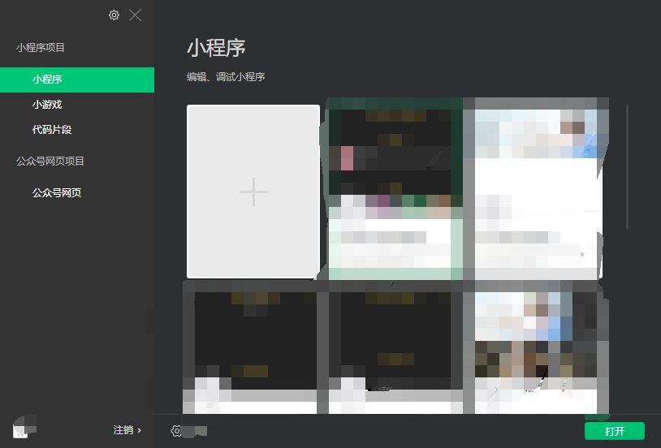

   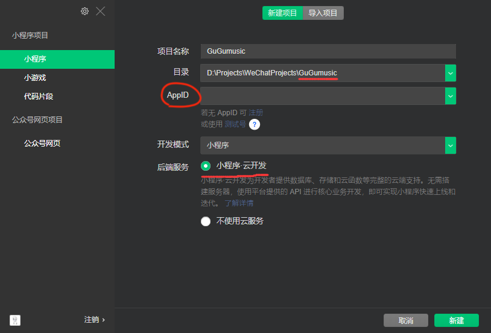

   

#### 3.创建云环境并配置
1. 创建请参照[官方指引](https://developers.weixin.qq.com/miniprogram/dev/wxcloud/quick-start/miniprogram.html)

2. 云开发控制台中，在“数据库”界面下创建3个集合：blog、blog-comment、user
	
	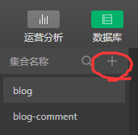
	
	同时将三个集合的数据权限改为：“所有用户可读，仅创建者可读写”
	
3. 云开发控制台中，在“存储”界面下创建两个文件夹：blog-image、blog-video

   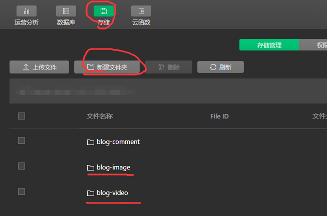

#### 4.部署云函数
1. 回到开发者工具主界面，在资源管理器中找到cloudfunctions文件夹，右键，选择环境为刚刚配置好的（一般会自动配置，从上一步到创建环境到这大概需等待 20-30min，可以尝试重启微信开发者工具）的环境

   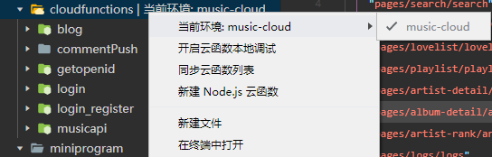

2. 将该文件夹下的所有文件夹（即云函数），右键->选择“上传并部署：云端安装依赖（不上传node_modules）“

   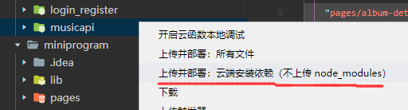

   上传需要一定时间（特别是musicapi文件夹），可以通过微信开发这工具有下角的小圆圈查看上传进度，注意如果有网路问题导致上传部署失败，则对应的云函数再右键再上传一次

#### 5.点击编译，即可使用辽

​	可以点击真机调试进行测试，想要更实际的体验（真机测试由于数据需要不断传到PC端会较卡）的话可以上传测试版

### 有什么问题也欢迎提出鸭~

